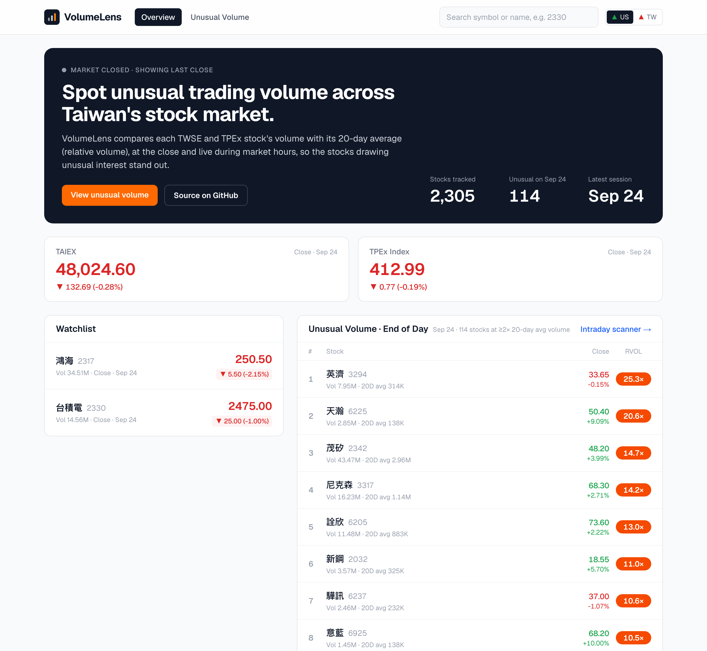
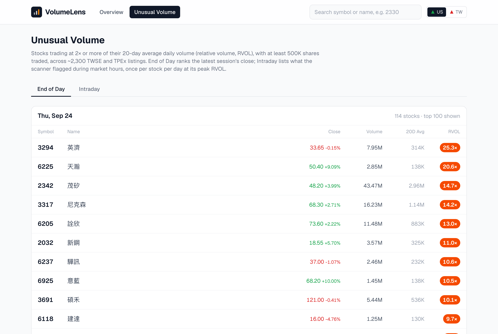
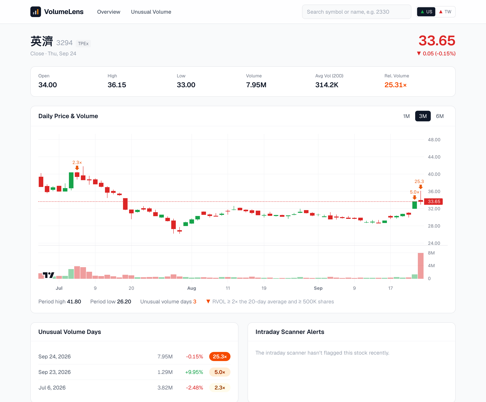
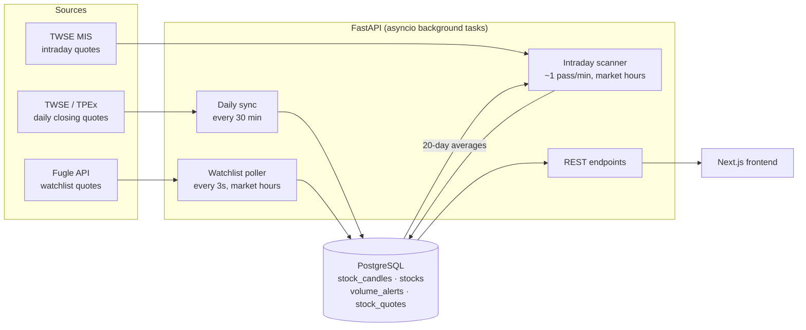

# VolumeLens

**Spot unusual trading volume across Taiwan's stock market.**

VolumeLens scans ~2,300 stocks and ETFs listed on the Taiwan Stock Exchange (TWSE) and the Taipei Exchange (TPEx), compares each one's volume with its 20-day average (relative volume, or RVOL), and surfaces the ones trading far outside their normal range, both at the close and live during market hours.

I invest in Taiwan stocks and wanted a faster way to see where unusual interest is building. Volume often moves before price, but the tools I used only showed it one ticker at a time.



## Features

- **End-of-day rankings.** Every stock whose latest session traded at ≥2× its prior 20-day average volume (and ≥500K shares), ranked by RVOL. Works any time, including nights and weekends in the US.
- **Intraday scanner.** During Taiwan market hours, the whole market is re-scanned about once a minute and flagged stocks are recorded once per day at their peak RVOL.
- **Stock pages for every listing.** Daily candlesticks with a volume pane, unusual-volume markers, 1M/3M/6M ranges, and a history of unusual-volume days.
- **Market overview.** TAIEX and TPEx index, a live watchlist, and the day's top unusual-volume names.
- **Search** by symbol or name, and a **US/Taiwan color toggle**: US convention (green = up) by default, or Taiwan's (red = up).

| Unusual Volume | Stock page |
| --- | --- |
|  |  |

## Architecture



The FastAPI app starts three background tasks in its lifespan:

| Task | What it does | Source |
| --- | --- | --- |
| Daily sync | Keeps `stock_candles` complete: every 30 minutes, fetches any weekday in the last 10 days that isn't fully stored yet | TWSE + TPEx |
| Intraday scanner | Loads 20-day averages from the database, then checks every listing's cumulative volume in batches of 100 | TWSE MIS |
| Watchlist poller | Live quotes for the watchlist; stores a row only when price or volume changes | Fugle |

The database holds about 280K daily candles (six months × ~2,300 listings). The Next.js frontend talks to the API through a `/api/*` rewrite.

## Engineering notes

A few problems that shaped the design.

### A bug that kept the scanner from ever firing

The first scanner compared Fugle's intraday volume against a 20-day average built from Fugle's daily candles, and it never flagged a single stock. The two endpoints use different units: intraday volume is in **lots** (張, 1,000 shares) and daily candles are in **shares**, so every stock looked like it was trading at ~0.1% of normal. Averages are now converted to lots before comparing, and the unit of every volume field is documented at its source.

A related question came up when the site's volume didn't match my brokerage app. I pulled each trade type from TWSE for TSMC (2330) on one day, and they reconcile exactly:

| Component | Shares |
| --- | ---: |
| Regular session, board lots | 12,990,000 |
| Intraday odd lots | 1,280,928 |
| After-hours odd lots | 38,734 |
| After-hours fixed price | 15,000 |
| Block trades | 233,000 |
| **Total (exchange daily volume)** | **14,557,662** |

My brokerage app shows board lots plus after-hours fixed price (13,005 lots); the exchange's daily figure includes everything.

### Scanning the whole market within rate limits

Checking ~2,300 stocks once a minute with one Fugle request per symbol means ~2,300 requests a minute, well beyond the API's rate limit, and Fugle's batch snapshot endpoints return `Forbidden` on my plan. Worse, the original code swallowed the resulting HTTP 429s, so most of the market went unscanned without any sign of it. The scanner now uses TWSE's MIS endpoint, which accepts about 100 symbols per request (I measured the limit: 150 returns an error and ~300 overflows the URL). A full pass is **24 requests instead of ~2,300**; in a replay of one session it covered 2,302/2,302 symbols in about 70 seconds with no failures. Fugle is now only used for the watchlist.

### Backfilling by date instead of by symbol

Six months of history per symbol from Fugle would be thousands of rate-limited calls. The TWSE and TPEx closing-quote endpoints return the **whole market for one day** per request, so a 180-day backfill is ~250 requests. They are undocumented website endpoints, so the parser handles thousands separators, `--`/`---` for untraded stocks, a sign column that TWSE embeds as HTML, TPEx responses that often get cut off mid-transfer (retried), and warrants and bonds mixed in with stocks (filtered by symbol pattern). Before loading everything, I cross-checked one day against Fugle's candles: open, high, low, close, volume, turnover and change matched exactly for every overlapping symbol.

### Averages in SQL instead of API calls

The scanner used to call the API once per symbol at startup to compute averages, which took several minutes and ran again on every reload. It now computes them from the database with a window function in about 0.2 seconds:

```sql
-- latest 20 trading days per symbol, regardless of holidays
ROW_NUMBER() OVER (PARTITION BY symbol ORDER BY date DESC) AS rn  -- keep rn <= 20
```

The end-of-day rankings compare each day with the **previous** 20 days, so a spike doesn't inflate its own baseline:

```sql
AVG(volume) OVER (PARTITION BY symbol ORDER BY date
                  ROWS BETWEEN 20 PRECEDING AND 1 PRECEDING)
```

### Idempotent sync

Instead of a once-a-day cron job that silently misses a day when the server is down or an exchange publishes late, the sync is a reconciliation loop. Each pass checks what's actually stored and fills in anything incomplete; inserts use `ON CONFLICT DO NOTHING` on `(symbol, date)`. Running it once or a hundred times gives the same result, and the same code powers the one-off backfill script.

### Time zones

The market runs 09:00–13:30 Taipei time, the containers run on UTC, and I'm in US Eastern time. Timestamps are stored as UTC, serialized with an explicit offset (an ISO string without one gets read as the viewer's local time), and always displayed in Taipei time. Trading-day logic ("today", market hours, when to sync) uses Asia/Taipei. In SQL, `timezone('Asia/Taipei', timezone('UTC', recorded_at))` converts stored times to Taipei wall-clock time.

### Designing for a closed market

Taiwan's session is 9 PM–1:30 AM US Eastern, so most visitors will arrive while the market is closed. Every page falls back to the latest close instead of showing empty panels: the watchlist shows the last daily candle, the unusual-volume page defaults to end-of-day rankings, and stock pages are built on daily data rather than on intraday quotes that only exist for a few symbols. The index quotes use a stale-while-revalidate cache, so a slow upstream response never blocks the page.

## Tech stack

- **Backend:** Python 3.12, FastAPI, SQLAlchemy 2.0 (async) with asyncpg, Alembic, PostgreSQL 16, Docker Compose
- **Frontend:** Next.js 16 (App Router), React 19, Tailwind CSS 4, TradingView Lightweight Charts 5
- **Data:** TWSE and TPEx daily closing quotes, TWSE MIS intraday quotes, [Fugle Market Data API](https://developer.fugle.tw/)

## Running locally

You need Docker, Node.js 20+ and a [Fugle API key](https://developer.fugle.tw/) (only used for watchlist quotes).

```bash
# 1. Configure
cp .env.example .env          # then set FUGLE_API_KEY

# 2. Start PostgreSQL and the API (migrations run automatically)
docker compose up --build

# 3. Load six months of daily data for the whole market (~35 min, safe to re-run)
docker compose exec api python -m app.script.backfill_market --days 180

# 4. Start the frontend
cd frontend && npm install && npm run dev
```

Open http://localhost:3000. After the backfill, the API's daily sync keeps the data current on its own. The poller and scanner only run during Taiwan market hours; set `FORCE_POLL=true` in `.env` to run them at other times while developing (the scanner then makes ~24 requests a minute).

## API

| Endpoint | Description |
| --- | --- |
| `GET /api/market` | TAIEX and TPEx index, stocks tracked, latest session |
| `GET /api/stocks` | Watchlist quotes (live, or the latest close) and `market_open` |
| `GET /api/daily-spikes?limit=` | Unusual volume on the latest trading day, ranked by RVOL |
| `GET /api/alerts?days=` | Intraday scanner alerts, one per stock per day at peak RVOL |
| `GET /api/stocks/{symbol}/detail` | Daily candles, latest intraday session and alerts for one stock |
| `GET /api/search?q=` | Symbol prefix or name search |

## Project structure

```
app/
  main.py                 FastAPI app, lifespan background tasks, routes
  services/
    daily_sync.py         reconciliation loop that keeps stock_candles current
    exchange_daily.py     fetch + clean one day of TWSE/TPEx closing quotes
    radar.py              intraday unusual-volume scanner
    mis_quotes.py         batched TWSE MIS quotes (stocks and indices)
    stock_poller.py       watchlist quotes from Fugle
    market_hours.py       Taiwan market-hours check
  models/                 SQLAlchemy models
  script/                 backfill scripts
alembic/                  database migrations
frontend/
  app/                    Next.js pages (overview, unusual volume, stock detail)
  components/             nav, search, color convention toggle
  lib/format.js           number, date and time formatting
```

## Limitations and next steps

- **Time-of-day normalization.** The intraday scanner compares cumulative volume so far with a full-day average, so early in the session only extreme spikes qualify. Comparing against the average volume *by this time of day* would catch them sooner.
- **Holiday calendar.** Market-hours checks don't know about Taiwan holidays, so the poller and scanner run (and find nothing) on those days. The daily sync already detects holidays from empty exchange data.
- **Undocumented endpoints.** The TWSE, TPEx and MIS JSON endpoints could change without notice. Failures are logged per batch or exchange-day and retried on the next pass, but a format change would need a parser update.
- **Tests and CI.** The parsers and window-function queries are good candidates for unit tests against recorded exchange responses.
- **Configurable watchlist.** The watchlist is currently fixed in code.

## Data and disclaimer

Market data comes from the Taiwan Stock Exchange, the Taipei Exchange and Fugle. This is a personal project for informational purposes only and is not investment advice.
